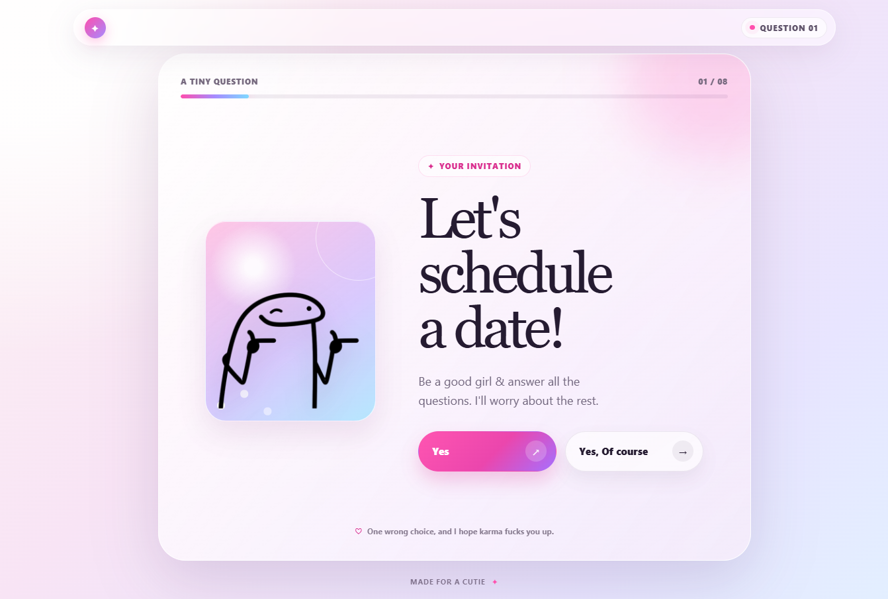
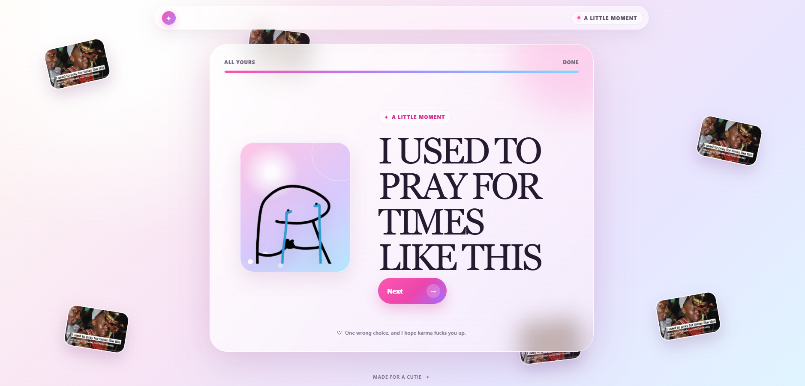

# Date Questionnaire

A small, single-page interactive website for asking someone out and collecting their answers locally. It was made with a playful, parody-minded sense of humor: the copy, choices, sound effects, and outcomes are intentionally personal and exaggerated. Treat it as a customizable template rather than a polished public product.

The current experience asks about:

- agreeing to schedule a date;
- whether the visitor likes Ali;
- preferred date activity and an optional custom idea;
- a limited set of available dates;
- a short knowledge quiz that shows a score;
- uploading a selfie;
- a final playful kissing question with different outcomes.

All prompts, images, audio, answers, score messages, and branching behavior can be changed to suit your own date invitation.

## What it does

- Runs on `127.0.0.1:8000` using only Python's standard library.
- Keeps the entire experience on one page, changing scenes without navigation.
- Records approved choices and quiz answers/scores as timestamped text in `data/responses.txt`.
- Stores uploaded selfies locally in `data/uploads/`, outside the public static-file routes.
- Uses user-supplied images and music from `site/images/` and `site/music/`.
- Can be shared temporarily through a Pinggy HTTPS tunnel without a domain or router port forwarding.

## Requirements

- Python 3
- Windows OpenSSH Client (`ssh`) for Pinggy sharing

No project packages, database, container, or build step are required.

## Run locally

From the project folder:

```powershell
python app.py
```

Then open [http://127.0.0.1:8000](http://127.0.0.1:8000).

The terminal must remain open while the site is running. Stop it safely with `Ctrl+C`.

## Share temporarily with Pinggy

With the Python server still running, open a second PowerShell window in the project folder and run:

```powershell
ssh -p 443 -R0:127.0.0.1:8000 free@a.pinggy.io
```

Pinggy prints a temporary public HTTPS URL. Share that URL with the intended visitor. Keep both the Python server and SSH tunnel running for as long as the site should be available. Stop the tunnel with `Ctrl+C`.

This uses an outbound SSH tunnel. It does not require a domain, router configuration, port forwarding, or direct exposure of your computer's local port.

## Check that it works

With the server running:

```powershell
Invoke-WebRequest http://127.0.0.1:8000 -UseBasicParsing
```

Walk through the page in a browser, then inspect locally recorded choices if needed:

```powershell
Get-Content data\responses.txt
```

Uploaded selfie files are saved in `data/uploads/` under generated filenames.

## Customize it

The main places to edit are:

- `site/app.js` — prompts, choices, question order, quiz questions, score messages, and branching behavior.
- `site/index.html` — page-level markup and audio elements.
- `site/styles.css` — visual design and responsive behavior.
- `site/images/` — illustrations and celebration media.
- `site/music/` — background and branch-specific audio.
- `app.py` — server-side choice validation, quiz scoring, upload rules, and static-file allow-list.

If you add a new saved answer or a new public image/audio file, update `app.py` as well as the browser code. The server intentionally accepts only declared choices and explicitly allowed static paths.



## Ideas and contributions

Have an idea for a fun interaction, a cleaner setup, or a better way to customize the flow? Open an issue and share it. Pull requests are welcome too — especially improvements that keep the project lightweight, playful, and easy to adapt.
